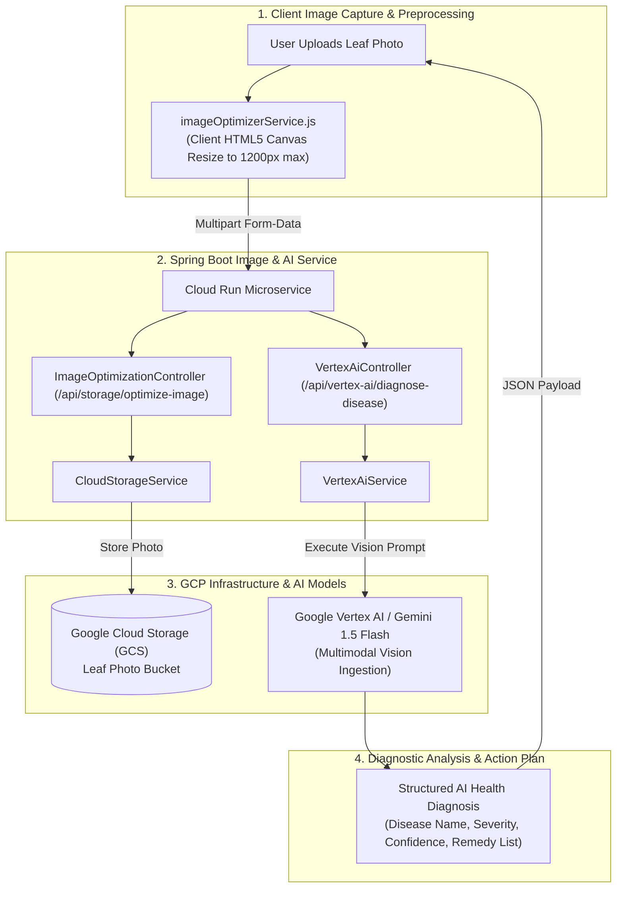

# 🧠 PlantCare Vertex AI & Multimodal Vision Architecture

**AI Infrastructure:** Google Vertex AI / Gemini Multimodal Vision API  
**Model Family:** `gemini-1.5-flash` / `gemini-1.5-pro`  
**Image Processing Pipeline:** HTML5 Canvas Client Optimization + Spring Boot Image Service  
**Storage Integration:** Google Cloud Storage (`plant-watering-tracker-2026.appspot.com`)  
**Document Version:** `1.0.0`  
**Last Updated:** September 2026  

---

## 🏛️ End-to-End AI Diagnostic Pipeline (Mermaid)



---

## 🔬 Image Optimization & Compression Pipeline

To ensure sub-2 second AI inference latency and reduce bandwidth:

1. **Client-Side HTML5 Canvas Resizing (`imageOptimizerService.js`)**:
   * Reads raw image file from camera or file picker.
   * Maintains original aspect ratio while constraining maximum width/height to **1200 pixels**.
   * Converts high-resolution 12MB photos into a lightweight 250KB WebP/JPEG payload.
2. **Server-Side Storage Upload (`CloudStorageService.java`)**:
   * Generates unique object key: `leaf_diagnostics/{timestamp}_{uuid}.jpg`.
   * Sets object metadata `Content-Type: image/jpeg` and stores object in GCS bucket `plant-watering-tracker-2026.appspot.com`.

---

## 🎯 Vertex AI Multimodal Disease Diagnosis Engine

### Endpoint: `POST /api/vertex-ai/diagnose-disease`

The backend executes a structured multimodal prompt combining image bytes with botanical diagnostic rules:

#### Prompt Template (`VertexAiService.java`):
> *"You are an expert botanical pathologist. Analyze this leaf photo carefully. Identify any signs of fungal infection, bacterial leaf spot, pest infestation, nutrient deficiency, or environmental distress (over-watering/under-watering). Return a JSON object with: 1) disease name, 2) confidence score (0.0 to 1.0), 3) severity level (Low, Moderate, Critical), and 4) a 3-step action treatment plan."*

#### Structured Output Payload:
```json
{
  "status": "OK",
  "disease": "Powdery Mildew (Podosphaera xanthii)",
  "confidence": 0.95,
  "severity": "Moderate",
  "symptoms": "White dusty fungal spots covering upper leaf surfaces.",
  "treatment": [
    "Isolate plant immediately to prevent airborne spore propagation.",
    "Apply neem oil organic fungicide spray to affected leaves every 7 days.",
    "Increase ambient air movement and ensure foliage remains dry during watering."
  ],
  "photoUrl": "https://storage.googleapis.com/plant-watering-tracker-2026.appspot.com/leaf_diagnostics/1725800000.jpg"
}
```

---

## 🌿 Vertex AI Species Identification Engine

### Endpoint: `POST /api/vertex-ai/identify-species`

#### Prompt Template:
> *"Analyze this plant image and identify its exact botanical species name, common English name, plant family, ideal sunlight requirements, and recommended watering frequency in days."*

#### Structured Output Payload:
```json
{
  "status": "OK",
  "identifiedSpecies": "Monstera deliciosa",
  "commonName": "Swiss Cheese Plant",
  "family": "Araceae",
  "sunlight": "Bright Indirect Sunlight",
  "recommendedFrequencyDays": 7,
  "baseWaterMl": 350
}
```

---

## 🛡️ Fallback Heuristic Diagnostics

If network connectivity is unavailable or Vertex AI rate limits are reached, the application falls back to **`aiVisionService.js`** heuristic rule engine:
* Analyzes user-selected physical symptoms (e.g. "yellow leaves", "brown spots", "drooping stems").
* Matches symptoms against the internal botanical rule dictionary (`plantAssistant.js`).
* Generates an immediate offline diagnostic recommendation to ensure uninterrupted plant care.
