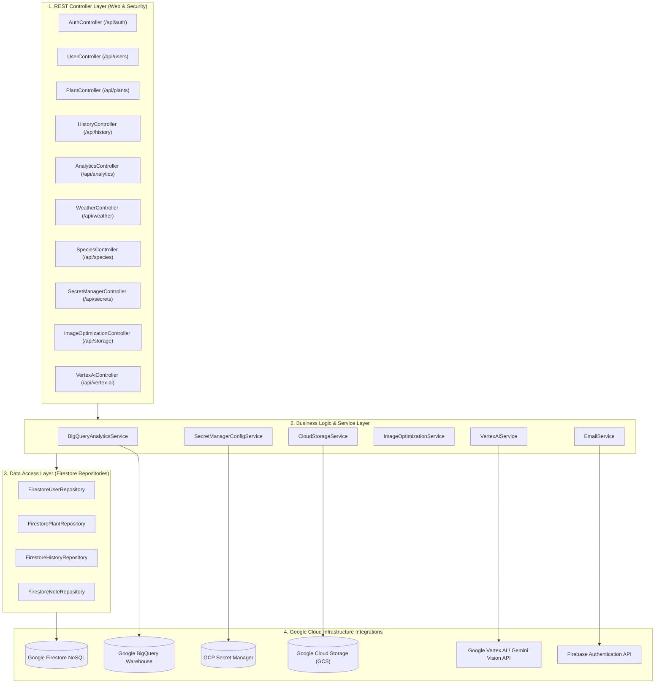

# ☕ PlantCare Backend Microservices Architecture Specification

**Service Name:** `plant-care-service`  
**GCP Host:** Google Cloud Run (`asia-south1` Mumbai)  
**Production Base URL:** `https://plant-care-service-358974981913.asia-south1.run.app`  
**Framework Stack:** Java 17, Spring Boot 3.2.5, Spring Security, Firebase Admin SDK 9.2.0, Google Cloud Libraries BOM 26.86.0  
**Document Version:** `1.0.0`  
**Last Updated:** September 2026  

---

## 🏛️ Microservice Architectural Overview

The **PlantCare Backend Microservice** is built using Spring Boot 3 and deployed as a serverless container on **Google Cloud Run**. It handles authentication, database operations, AI disease diagnosis, external weather calculations, and enterprise BigQuery analytics event streaming.



---

## 📂 Backend Project Structure

```
backend/plant-care-service/
├── Dockerfile                      # Multi-stage Maven + JRE 17 container build
├── pom.xml                         # Maven dependencies (Spring Boot, Firebase, GCP SDK)
└── src/
    └── main/
        ├── java/com/plantcare/service/
        │   ├── config/             # Spring Security, JWT, Firebase Initialization
        │   ├── controller/         # 11 REST API Controllers
        │   ├── dto/                # Data Transfer Objects (Requests & Responses)
        │   ├── firestore/          # 4 Firestore Repository Data Access Classes
        │   ├── model/              # Domain Models (User, Plant, History, Note)
        │   └── service/            # 6 Core Business Logic & GCP Integration Services
        └── resources/
            └── application.properties # Spring configuration parameters
```

---

## 🛠️ Controller & API Endpoint Specifications

### 1. 🔑 `AuthController` (`/api/auth`)
Handles user registration, authentication, password reset, and Firebase Auth synchronization.
* `POST /api/auth/signup`: Registers a new user account in Firestore and syncs user with Firebase Auth.
* `POST /api/auth/signin`: Authenticates credentials, validates account status, and issues an HS256 signed JWT token.
* `POST /api/auth/forgot-password`: Generates password reset verification links.
* `POST /api/auth/reset-password`: Updates password for verified reset requests.

### 2. 👤 `UserController` (`/api/users`)
Manages user accounts, admin profile queries, and multi-step email change verification.
* `GET /api/users`: Returns registered user profile list (Admin scope) or personal user object.
* `GET /api/users/{id}`: Fetches specific user profile details.
* `PUT /api/users/{id}`: Updates user details, role (`USER`/`ADMIN`), and status (`Active`/`Suspended`).
* `POST /api/users/request-email-change`: Generates 6-digit OTP verification code, sends OTP to new email address, and sends a security alert to old email address.
* `POST /api/users/verify-email-change`: Validates 6-digit OTP code, updates user email in Firestore, and issues a fresh updated JWT token.

### 3. 🌿 `PlantController` (`/api/plants`)
Manages user garden plants, watering schedules, and care streaks.
* `GET /api/plants`: Returns all active plants for the authenticated user context.
* `POST /api/plants`: Creates a new plant record in Firestore and uploads photo asset.
* `GET /api/plants/{id}`: Fetches detailed plant entity by ID.
* `PUT /api/plants/{id}`: Updates plant parameters (`frequency`, `sunlight`, `waterMl`, `locationCity`).
* `DELETE /api/plants/{id}`: Deletes plant record from Firestore.
* `POST /api/plants/{id}/water`: Logs watering event, calculates streaks (`currentStreak`, `bestStreak`), updates `lastWatered` date, and creates timeline history entry.

### 4. 📜 `HistoryController` (`/api/history`)
Tracks plant care activity timeline logs.
* `GET /api/history`: Returns chronologically ordered care history events (`watering`, `note`, `streak`, `ai_doctor`).

### 5. 📊 `AnalyticsController` (`/api/analytics`)
Enterprise BigQuery analytics report generation & event synchronization.
* `GET /api/analytics/bigquery-report`: Returns aggregated metrics including top species per location, room streak retention rates, and heatwave correlations.
* `POST /api/analytics/bigquery-sync`: Triggers manual live streaming event synchronization into BigQuery dataset `plant_analytics_db`.

### 6. ☀️ `WeatherController` (`/api/weather`)
Integrates with Open-Meteo Weather API for location-based climate intelligence.
* `GET /api/weather?location={city}`: Fetches real-time temperature, humidity, evapotranspiration rate, and soil moisture adjustment recommendations.

### 7. 🌱 `SpeciesController` (`/api/species`)
Botanical catalog search engine.
* `GET /api/species/search?q={query}`: Searches built-in and external botanical catalog for plant species information, sunlight needs, and recommended watering base volume.

### 8. 🔒 `SecretManagerController` (`/api/secrets`)
Monitors GCP Secret Manager integration.
* `GET /api/secrets/status`: Verifies active status of managed secrets (`OPENWEATHER_API_KEY`, `TREFLE_API_TOKEN`, `JWT_SECRET`).

### 9. 🖼️ `ImageOptimizationController` (`/api/storage`)
Cloud photo optimization pipeline.
* `POST /api/storage/optimize-image`: Accepts uploaded multipart image file, resizes, compresses, labels, and returns optimized cloud image URL.

### 10. 🧠 `VertexAiController` (`/api/vertex-ai`)
Multimodal AI plant diagnostics.
* `POST /api/vertex-ai/diagnose-disease`: Runs Vertex AI / Gemini Vision analysis on uploaded leaf image to detect diseases, health score, and recommended remedies.
* `POST /api/vertex-ai/identify-species`: Identifies plant species from leaf photo uploads.

### 11. 🔔 `NotificationController` (`/api/notifications`)
Manages automated care reminders and push notification payloads.
* `GET /api/notifications`: Retrieves overdue and upcoming watering notification alerts.

---

## ⚙️ Core Service Layer Architecture

### 1. `BigQueryAnalyticsService`
* Formats Firestore records for streaming into BigQuery dataset `plant_analytics_db` and table `plant_care_logs_sync`.
* Computes normalized city species distribution and location streak retention.

### 2. `CloudStorageService`
* Connects to Google Cloud Storage (GCS) bucket `plant-watering-tracker-2026.appspot.com`.
* Handles multipart image upload, object ACL configuration, and public URL generation.

### 3. `EmailService`
* Delivers transactional emails for 6-digit email change OTP codes, security alerts, and password resets via Spring Mail / SMTP / Web3Forms fallback.

### 4. `ImageOptimizationService`
* Performs server-side image compression, thumbnail generation, and quality optimization.

### 5. `SecretManagerConfigService`
* Uses Google Cloud Secret Manager SDK (`SecretManagerServiceClient`) to securely retrieve runtime credentials.

### 6. `VertexAiService`
* Formats multimodal vision prompts and executes generative inference via Google Vertex AI / Gemini APIs.

---

## 🗄️ Firestore Data Access Layer (Repositories)

* `FirestoreUserRepository`: CRUD operations on `users` collection in Firestore.
* `FirestorePlantRepository`: CRUD operations on `plants` collection in Firestore.
* `FirestoreHistoryRepository`: Query and sorting operations on `history` collection.
* `FirestoreNoteRepository`: Document access for `notes` collection.

---

## 🔒 Security & JWT Authentication Model

1. **Stateless JWT Security Filter (`JwtAuthenticationFilter`):**
   * Intercepts incoming HTTP requests.
   * Extracts `Authorization: Bearer <token>` header.
   * Validates HS256 signature using `JwtUtil` and sets `SecurityContextHolder` principal.

2. **CORS & Web Security (`WebConfig` & `SecurityConfig`):**
   * Configured to accept cross-origin requests from `https://plant-watering-tracker-2026.web.app` and local dev environments.
   * CSRF disabled for stateless REST APIs.

---

## 🧪 Automated Testing & Verification

Run the comprehensive 19-endpoint automated test suite:

```bash
node scratch/test_full_backend_audit.js
node scratch/test_gcp_services_health.js
```
