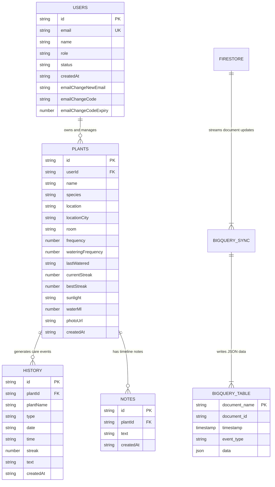

# 🗄️ PlantCare Database & Data Warehouse Schema Specification

**Project Name:** PlantCare Enterprise — Smart Plant Care & AI Diagnostics Tracker  
**Firestore Instance:** `plant-watering-tracker-2026` (Native NoSQL)  
**BigQuery Dataset:** `plant_watering_tracker-2026:plant_analytics_db`  
**BigQuery Table:** `plant_care_logs_sync`  
**Document Version:** `1.0.0`  
**Last Updated:** September 2026  

---

## 🏛️ Executive Data Architecture Overview

The **PlantCare Enterprise** platform uses a dual database architecture:

1. **Transactional Database (Google Firestore):** High-speed, real-time NoSQL document database servicing low-latency user actions, plant CRUD, streak calculations, and care logs.
2. **Analytical Data Warehouse (Google BigQuery):** High-performance analytical data warehouse receiving event streams from Firestore via **Firebase BigQuery Sync Extension v2**, feeding SQL queries into **Google Looker Studio**.

---

## 📐 Entity Relationship & Data Flow Diagram (Mermaid)



---

## ⚡ 1. Google Firestore NoSQL Schema (Transactional Data)

### Collection 1: `users`
Stores user profile credentials, assigned system roles, account status, and email modification verification state.

| Field Name | Data Type | Constraint | Description |
| :--- | :--- | :--- | :--- |
| `id` | String | **Primary Key** | Unique user identifier (e.g. `u_1725800000`). |
| `email` | String | **Unique Index** | User email address (lowercased & trimmed). |
| `name` | String | Required | Full display name of the user. |
| `role` | String | Required | Authorization role (`USER` or `ADMIN`). |
| `status` | String | Required | Account state (`Active` or `Suspended`). |
| `createdAt` | String (ISO-8601) | Required | Account registration timestamp. |
| `emailChangeNewEmail` | String | Optional | Pending email address requested for update. |
| `emailChangeCode` | String | Optional | 6-digit OTP verification code. |
| `emailChangeCodeExpiry` | Number (Unix ms) | Optional | OTP code expiration timestamp. |

#### Example Document (`users/u_admin001`):
```json
{
  "id": "u_admin001",
  "email": "admin@plantdoc.com",
  "name": "Platform Administrator",
  "role": "ADMIN",
  "status": "Active",
  "createdAt": "2026-09-01T00:00:00.000Z",
  "emailChangeNewEmail": null,
  "emailChangeCode": null,
  "emailChangeCodeExpiry": null
}
```

---

### Collection 2: `plants`
Stores user garden specimens, watering frequencies, location metadata, streaks, and health requirements.

| Field Name | Data Type | Constraint | Description |
| :--- | :--- | :--- | :--- |
| `id` | String | **Primary Key** | Unique plant UUID. |
| `userId` | String | **Foreign Key** | References `users.id`. |
| `name` | String | Required | Custom plant name (e.g., "Living Room Monstera"). |
| `species` | String | Required | Botanical species name (e.g., "Monstera deliciosa"). |
| `location` | String | Required | Room and city string (e.g., "Living Room, Coimbatore"). |
| `locationCity` | String | Required | Extracted city name for climate lookup (e.g., "Coimbatore"). |
| `room` | String | Optional | Room placement (e.g., "Living Room", "Office", "Balcony"). |
| `frequency` | Number (Integer) | Required | Watering schedule frequency in days (e.g. `7`). |
| `lastWatered` | String (YYYY-MM-DD) | Required | Date when the plant was last watered. |
| `currentStreak` | Number (Integer) | Required | Active care streak count. |
| `bestStreak` | Number (Integer) | Required | All-time highest care streak. |
| `sunlight` | String | Required | Light requirements (e.g., "Indirect Sunlight", "Direct Sunlight"). |
| `waterMl` | Number (Integer) | Required | Recommended watering volume in milliliters. |
| `photoUrl` | String | Optional | Cloud Storage URL of the plant image. |
| `createdAt` | String (ISO-8601) | Required | Creation timestamp. |

#### Example Document (`plants/p_monstera_01`):
```json
{
  "id": "p_monstera_01",
  "userId": "u_admin001",
  "name": "Office Monstera",
  "species": "Monstera deliciosa",
  "location": "Office, Coimbatore",
  "locationCity": "Coimbatore",
  "room": "Office",
  "frequency": 7,
  "lastWatered": "2026-09-08",
  "currentStreak": 4,
  "bestStreak": 9,
  "sunlight": "Indirect Sunlight",
  "waterMl": 350,
  "photoUrl": "https://storage.googleapis.com/plant-watering-tracker-2026.appspot.com/plants/p_monstera_01.jpg",
  "createdAt": "2026-09-01T10:30:00.000Z"
}
```

---

### Collection 3: `history`
Stores activity logs for watering events, timeline notes, streak achievements, and AI diagnostics.

| Field Name | Data Type | Constraint | Description |
| :--- | :--- | :--- | :--- |
| `id` | String | **Primary Key** | History event log ID (e.g., `h_1725800000_123`). |
| `plantId` | String | **Foreign Key** | References `plants.id`. |
| `plantName` | String | Required | Plant name snapshot. |
| `type` | String | Required | Event classification (`watering`, `note`, `streak`, `ai_doctor`). |
| `date` | String (YYYY-MM-DD) | Required | Event date. |
| `time` | String | Required | Formatted event time (e.g., "10:30 AM"). |
| `streak` | Number (Integer) | Optional | Streak count associated with watering. |
| `text` | String | Optional | Note text or AI diagnosis summary. |
| `createdAt` | String (ISO-8601) | Required | Log creation timestamp. |

#### Example Document (`history/h_water_99`):
```json
{
  "id": "h_water_99",
  "plantId": "p_monstera_01",
  "plantName": "Office Monstera",
  "type": "watering",
  "date": "2026-09-08",
  "time": "10:30 AM",
  "streak": 4,
  "text": null,
  "createdAt": "2026-09-08T10:30:00.000Z"
}
```

---

### Collection 4: `notes`
Stores user health notes and observation logs attached to plant timelines.

| Field Name | Data Type | Constraint | Description |
| :--- | :--- | :--- | :--- |
| `id` | String | **Primary Key** | Note ID. |
| `plantId` | String | **Foreign Key** | References `plants.id`. |
| `text` | String | Required | User observation note. |
| `createdAt` | String (ISO-8601) | Required | Note creation timestamp. |

---

## 📊 2. Google BigQuery Data Warehouse Schema (Analytical Data)

### Dataset: `plant_watering_tracker-2026:plant_analytics_db`
### Table: `plant_care_logs_sync`

Streamed automatically from Firestore document mutations using **Firebase BigQuery Sync Extension v2**.

| Column Name | BigQuery SQL Type | Mode | Description |
| :--- | :--- | :--- | :--- |
| `document_name` | `STRING` | `REQUIRED` | Full Firestore document path (e.g., `projects/.../databases/(default)/documents/plants/p_01`). |
| `document_id` | `STRING` | `REQUIRED` | Document ID string. |
| `timestamp` | `TIMESTAMP` | `REQUIRED` | Stream ingestion timestamp. |
| `event_type` | `STRING` | `REQUIRED` | Firestore mutation type (`CREATE`, `UPDATE`, `IMPORT`, `DELETE`). |
| `operation` | `STRING` | `NULLABLE` | Operation descriptor. |
| `data` | `JSON` | `NULLABLE` | Full raw JSON snapshot of the Firestore document. |

#### Streamed JSON Structure in `data` Column:
```json
{
  "plant_id": "p_monstera_01",
  "name": "Office Monstera",
  "species": "Monstera deliciosa",
  "location": "Office, Coimbatore",
  "location_city": "Coimbatore",
  "frequency": 7,
  "last_watered": "2026-09-08",
  "current_streak": 4,
  "best_streak": 9,
  "sunlight": "Indirect Sunlight",
  "recommended_water_ml": 350
}
```

---

## 🚀 Performance Indexing & Optimization Strategy

1. **Firestore Single & Composite Indexes:**
   * `plants`: `userId ASC`, `name ASC` (for fast user garden queries).
   * `history`: `plantId ASC`, `date DESC`, `time DESC` (for timeline logs).
   * `users`: `email ASC` (Unique index for fast authentication lookup).

2. **BigQuery Partitioning & Clustering:**
   * **Partition By:** `DATE(timestamp)` (reduces query processing costs).
   * **Cluster By:** `event_type`, `document_id` (accelerates analytics filtering in Google Looker Studio).
