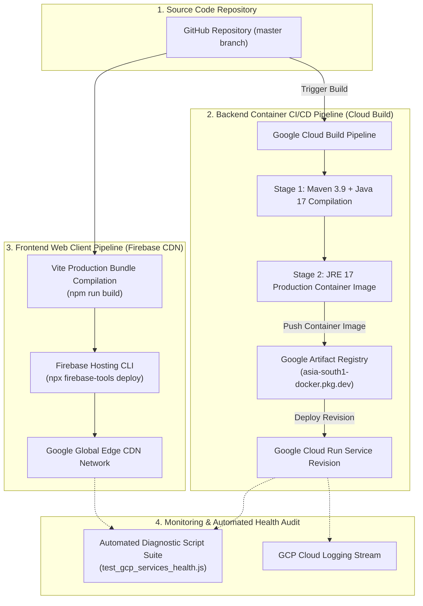

# 🚀 PlantCare DevOps, CI/CD & Deployment Operations Guide

**Cloud Provider:** Google Cloud Platform (GCP) & Firebase CDN  
**Compute Environment:** Google Cloud Run (`asia-south1` Mumbai)  
**CI/CD Pipeline:** Google Cloud Build + GitHub Integration  
**Container Registry:** Google Artifact Registry (`asia-south1-docker.pkg.dev`)  
**CDN Web Hosting:** Firebase Hosting (`https://plant-watering-tracker-2026.web.app`)  
**Document Version:** `1.0.0`  
**Last Updated:** September 2026  

---

## 🏛️ Continuous Integration & Continuous Deployment (CI/CD) Architecture



---

## 🛠️ 1. Backend Microservice Deployment Pipeline

### 1.1 Multi-Stage Docker Build (`Dockerfile`)
The Spring Boot backend container uses a multi-stage Docker build to keep the production image under 200MB:

```dockerfile
# Stage 1: Build Java Jar with Maven
FROM maven:3.9.6-eclipse-temurin-17 AS build
WORKDIR /app
COPY pom.xml .
COPY src ./src
RUN mvn clean package -DskipTests

# Stage 2: Production Lightweight JRE Image
FROM eclipse-temurin:17-jre
WORKDIR /app
COPY --from=build /app/target/*.jar app.jar

EXPOSE 8080
ENTRYPOINT ["java", "-jar", "app.jar"]
```

### 1.2 Google Cloud Build & Artifact Registry Commands
To manually build and deploy a new backend container revision to Cloud Run:

```bash
# 1. Submit Container Build to Cloud Build
gcloud builds submit --tag asia-south1-docker.pkg.dev/plant-watering-tracker-2026/cloud-run-source-deploy/plant-care-service:latest backend/plant-care-service

# 2. Deploy Revision to Cloud Run
gcloud run deploy plant-care-service \
  --image asia-south1-docker.pkg.dev/plant-watering-tracker-2026/cloud-run-source-deploy/plant-care-service:latest \
  --region asia-south1 \
  --platform managed \
  --allow-unauthenticated
```

---

## 🌐 2. Frontend Deployment Pipeline (Firebase Hosting)

To build and deploy the React 18 production bundle to Firebase Global Edge CDN:

```bash
# 1. Navigate to project root
cd c:\Users\prane\OneDrive\Desktop\npn-cts\plant_watering

# 2. Build Production Bundle
npm run build

# 3. Deploy to Firebase Hosting CDN
npx firebase-tools deploy --only hosting
```

---

## 📊 3. Operational Monitoring & Diagnostics

### 3.1 Real-Time Container Logs (GCP Cloud Logging)
View stdout/stderr logs from the live Cloud Run container:

```bash
gcloud logging read "resource.type=cloud_run_revision AND resource.labels.service_name=plant-care-service" --limit 50 --format json
```

### 3.2 Automated Comprehensive Health Verification
Run the built-in 100% backend endpoint and GCP cloud infrastructure audit test suites:

```bash
# Run 19-Endpoint Backend REST Audit
node scratch/test_full_backend_audit.js

# Run 7-Service GCP Infrastructure Health Audit
node scratch/test_gcp_services_health.js
```
