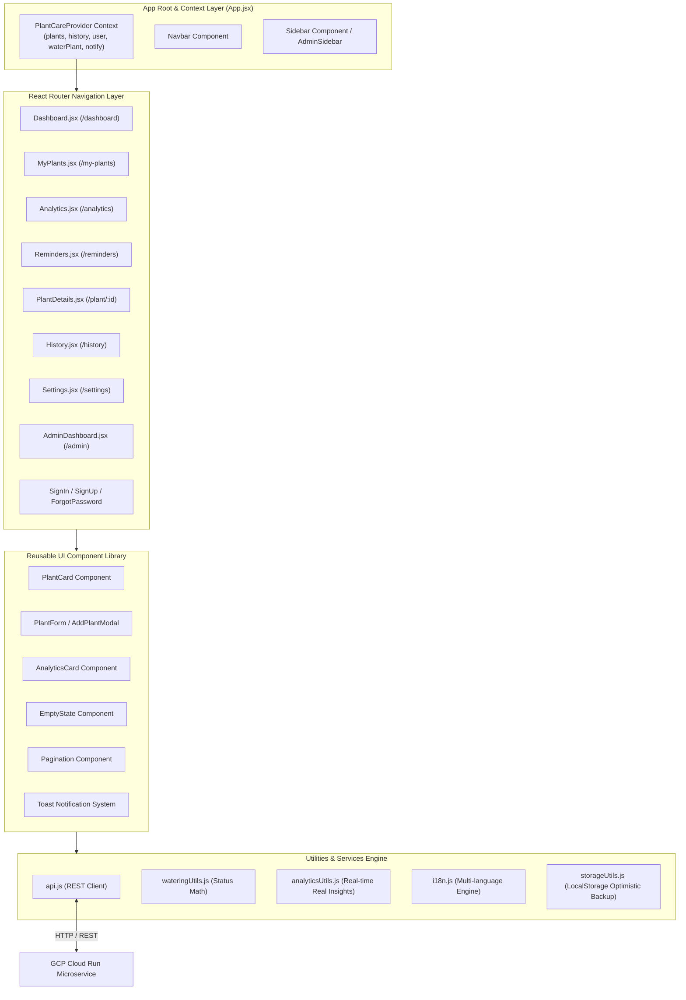

# 🎨 PlantCare Frontend Client Architecture Specification

**Framework Stack:** React 18.2, Vite 8.2, Lucide React Icons, Recharts 2.12, Vanilla CSS 3  
**State Management:** React Context API (`AppProvider`) + LocalStorage Optimistic Caching  
**Internationalization (i18n):** Multi-Language Engine (English, Tamil, Hindi, Kannada, Telugu, Malayalam)  
**Deployment Target:** Firebase Hosting Edge CDN (`https://plant-watering-tracker-2026.web.app`)  
**Document Version:** `1.0.0`  
**Last Updated:** September 2026  

---

## 🏛️ Client Component & Data Flow Architecture (Mermaid)



---

## 📂 Frontend Directory Structure

```
src/
├── App.jsx                         # Main Context Provider & App Shell
├── main.jsx                        # Entry point & React DOM render
├── index.css                       # Global CSS design tokens, typography & animations
├── firebase.js                     # Firebase Web SDK initialization & storage helpers
├── components/                     # Reusable UI components
│   ├── AdminSidebar.jsx            # Admin navigation drawer
│   ├── AnalyticsCard.jsx           # Metric display cards
│   ├── EmptyState.jsx              # Empty state placeholder fallback
│   ├── Navbar.jsx                  # Top navigation bar & quick profile dropdown
│   ├── Pagination.jsx              # Custom paginator control
│   ├── PlantCard.jsx               # Individual plant card with quick water action
│   ├── PlantForm.jsx               # Add / Edit plant modal form
│   ├── PlantSearch.jsx             # Species search autocomplete input
│   └── Sidebar.jsx                 # User navigation drawer
├── pages/                          # Application pages
│   ├── AdminDashboard.jsx          # Admin user management & status toggle
│   ├── Analytics.jsx               # Personal garden insights & Looker BI views
│   ├── AuthLoadingScreen.jsx       # Auth state verification spinner
│   ├── ChangePassword.jsx          # Change password form
│   ├── Dashboard.jsx               # Garden overview, health metrics & streak leaderboard
│   ├── ForgotPassword.jsx          # Password reset trigger page
│   ├── History.jsx                 # Filterable care event timeline log
│   ├── MyPlants.jsx                # Plant grid & location/status filters
│   ├── PlantDetails.jsx            # Detailed plant timeline, notes & health status
│   ├── Reminders.jsx               # Overdue / Today watering schedule & batch water
│   ├── Settings.jsx                # Profile, email change OTP modal, dark mode & i18n
│   ├── SignIn.jsx                  # Login page
│   └── SignUp.jsx                  # Registration page
├── services/                       # API Integration Layer
│   ├── aiVisionService.js          # Gemini / Vertex AI vision diagnostic client
│   ├── api.js                      # Centralized REST API fetch wrapper
│   ├── emailDispatcher.js          # Email notification dispatcher
│   ├── imageOptimizerService.js    # Client-side image canvas optimizer
│   └── notificationService.js     # Browser push & alert generator
└── utils/                          # Helper Utilities & Business Math
    ├── analyticsUtils.js           # Real-time room retention & species aggregation math
    ├── i18n.js                     # 6-Language translation dictionary & hook
    ├── plantAssistant.js           # Plant recommendations database
    ├── plantIconUtils.js           # Species emoji & icon mapping
    ├── storageUtils.js             # LocalStorage optimistic cache wrapper
    ├── timezoneUtils.js            # Regional timezone & city extractor
    └── wateringUtils.js            # Watering status, days elapsed & streak math
```

---

## 🎨 Global UI Design System & Aesthetic Tokens

The user interface follows a modern **Forest Green & Clean Minimalist** design system built with Vanilla CSS variables:

```css
:root {
  --primary-green: #16a34a;
  --primary-green-soft: #f0fdf4;
  --primary-green-border: #bbf7d0;
  
  --accent-orange: #ea580c;
  --accent-orange-soft: #fff7ed;
  --accent-orange-border: #ffedd5;
  
  --accent-red: #dc2626;
  --accent-red-soft: #fef2f2;
  
  --neutral-dark: #0f172a;
  --neutral-gray: #475569;
  --neutral-light: #f8faf7;
  --neutral-border: #e2e8f0;
  
  --radius-card: 20px;
  --radius-button: 12px;
  --shadow-subtle: 0 4px 16px rgba(0, 0, 0, 0.03);
  --shadow-card: 0 8px 24px rgba(0, 0, 0, 0.06);
}
```

### Aesthetic Principles
1. **Glassmorphism & Soft Elevations**: Soft subtle shadows (`0 4px 16px rgba(0,0,0,0.03)`), rounded card corners (`20px`), and frosted glass panels.
2. **Dynamic Watering Status Colors**:
   * **Safe (Healthy)**: Forest Green (`#16a34a`)
   * **Water Soon (Due in 1 day)**: Amber Warm (`#d97706`)
   * **Overdue (Needs Water)**: Crimson Red (`#dc2626`)
3. **Micro-animations & Interactive States**: Hover scale effects (`transform: translateY(-2px)`), button press feedback, smooth modal transitions, and dynamic SVG charts via Recharts.

---

## 🔄 State Management & LocalStorage Fallback

The global application state is managed centrally via `usePlantCare()` in `App.jsx`:

1. **Live State Synchronization**:
   * On application load, `App.jsx` calls `api.getPlants()` and `api.getHistory()`.
   * Data is cached in `LocalStorage` (`plantCarePlants`, `plantCareHistory`) to guarantee instant rendering even during poor network connectivity.
2. **Optimistic Local Fallbacks**:
   * When watering a plant (`waterPlant(id)`), the UI immediately updates local streak and last watered state, updates local storage, and asynchronously dispatches the HTTP request to GCP Cloud Run. If offline, changes persist locally until connection is restored.
