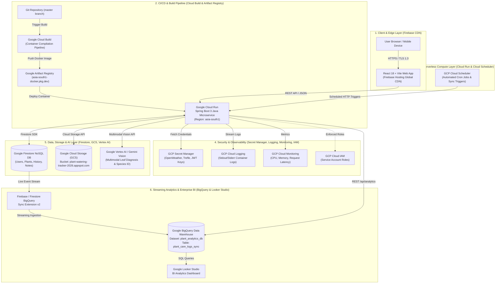

# ☁️ Google Cloud Platform (GCP) Comprehensive System Architecture

**Project Name:** PlantCare Enterprise — Smart Plant Care Tracker & AI Diagnostics  
**GCP Project ID:** `plant-watering-tracker-2026`  
**Primary GCP Region:** `asia-south1` (Mumbai, India)  
**Artifact Registry Location:** `asia-south1-docker.pkg.dev/plant-watering-tracker-2026/cloud-run-source-deploy/plant-care-service`  
**Firebase Hosting Domain:** `https://plant-watering-tracker-2026.web.app`  
**Cloud Run Production Endpoint:** `https://plant-care-service-358974981913.asia-south1.run.app`  
**Architecture Model:** Serverless Cloud-Native Microservices, CI/CD Automated Build Pipeline, Real-Time BigQuery Event Streaming & Multimodal Vertex AI  
**Document Version:** `3.0.0`  
**Last Updated:** September 2026  

---

## 🏛️ Executive Architecture Summary

The **PlantCare Enterprise** platform is engineered on a fully managed, serverless Google Cloud Platform (GCP) infrastructure. It integrates 14 distinct GCP cloud services:

1. **Google Cloud Run** — Serverless microservices execution environment.
2. **Google Cloud Build** — Serverless CI/CD container compilation & image creation pipeline.
3. **Google Artifact Registry** — Private Docker container image registry.
4. **Google Firestore** — Real-time NoSQL document database.
5. **Google BigQuery** — Enterprise data warehouse for streaming analytical BI.
6. **Firebase BigQuery Sync Extension v2** — Event-driven database extension streaming Firestore state changes.
7. **Google Vertex AI / Gemini Vision API** — Multimodal generative AI leaf diagnosis and species classification.
8. **GCP Cloud Scheduler** — Managed cron scheduler for periodic data sync and automated notification triggers.
9. **GCP Cloud Logging (Stackdriver)** — Real-time container log aggregation, request tracing, and diagnostic logs.
10. **GCP Cloud Monitoring** — Cloud Run CPU/Memory metrics, request latency, and container instance health.
11. **GCP Secret Manager** — Encrypted credential vault for API keys, JWT secrets, and external services.
12. **Google Cloud Storage (GCS)** — Scalable object storage bucket for leaf diagnostic photographs and media.
13. **GCP Cloud IAM (Identity & Access Management)** — Granular service account permissions and role-based access control.
14. **Firebase Hosting & Firebase Authentication Sync** — Global edge CDN hosting for single-page web app & user authentication.

---

## 📐 Enterprise Multi-Tier Architecture Diagram



---

## 🛠️ Complete Breakdown of Integrated GCP Services

### 1. 🚀 Google Cloud Run
* **Service Name:** `plant-care-service`
* **GCP Region:** `asia-south1` (Mumbai)
* **Live Production URL:** `https://plant-care-service-358974981913.asia-south1.run.app`
* **Technology:** Dockerized Java 17 Spring Boot 3 Microservice.
* **Function:** Auto-scales from 0 to 100 instances on demand to handle API request traffic, processing authentication, plant care logic, image optimization, and analytics endpoint requests.

### 2. 🔨 Google Cloud Build
* **Pipeline Name:** `cloud-run-source-deploy`
* **Function:** Provides fully managed serverless continuous integration (CI) and continuous delivery (CD). Automatically compiles Maven Java artifacts, builds multi-stage Docker container images, and provisions revisions to Cloud Run.

### 3. 📦 Google Artifact Registry
* **Repository Path:** `asia-south1-docker.pkg.dev/plant-watering-tracker-2026/cloud-run-source-deploy/plant-care-service`
* **Function:** Private, secure container registry storing versioned Docker images for deployment to Cloud Run.

### 4. ⚡ Google Firestore (NoSQL Database)
* **Database Instance:** `plant-watering-tracker-2026` (Native Mode)
* **Collections Architecture:**
  * `users`: User identity, hashed passwords, roles (`USER`, `ADMIN`), statuses (`Active`, `Suspended`), email change verification tokens.
  * `plants`: Garden plants (`name`, `species`, `location`, `locationCity`, `frequency`, `lastWatered`, `currentStreak`, `bestStreak`, `sunlight`, `waterMl`).
  * `history`: Care history events (`watering`, `note`, `streak`, `ai_doctor`).
  * `notes`: Timeline health notes.
* **Function:** Low-latency (<50ms) document database serving as primary persistent application state.

### 5. 📊 Google BigQuery (Enterprise Data Warehouse)
* **Dataset Identifier:** `plant_watering_tracker-2026:plant_analytics_db`
* **Primary Table:** `plant_care_logs_sync`
* **Function:** Serverless enterprise data warehouse processing SQL queries for plant species density, room retention rates, and regional climate correlation trends.

### 6. 🔄 Firebase BigQuery Sync Extension v2
* **Extension ID:** `firestore-bigquery-export`
* **Function:** Automatically listens to Firestore document changes and streams real-time JSON event payloads into BigQuery tables without manual ETL code.

### 7. 🧠 Google Vertex AI & Gemini Vision API
* **API Scope:** Multimodal Generative AI Vision Models (`gemini-1.5-flash` / `gemini-1.5-pro`).
* **Endpoints:**
  * `POST /api/vertex-ai/diagnose-disease`: Analyzes leaf photo upload for plant diseases (powdery mildew, chlorosis, leaf spot), severity ratings, and treatment guidance.
  * `POST /api/vertex-ai/identify-species`: Identifies species classification from leaf images.

### 8. ⏰ GCP Cloud Scheduler
* **Function:** Managed enterprise cron service executing periodic HTTP jobs:
  * Triggers background BigQuery analytics sync (`POST /api/analytics/bigquery-sync`).
  * Triggers daily watering reminder checks and automated notification dispatches.

### 9. 📜 GCP Cloud Logging (formerly Stackdriver Logging)
* **Function:** Centralized container log stream aggregation. Records Java Spring Boot `stdout` and `stderr` logs, application stack traces, HTTP request logs, and exception trace logs.

### 10. 📈 GCP Cloud Monitoring
* **Function:** Provides real-time metrics, dashboards, and operational alerts monitoring Cloud Run container CPU usage, memory utilization, container instance count, and request latency (p95 / p99).

### 11. 🔑 GCP Secret Manager
* **Service Name:** `SecretManagerConfigService`
* **Managed Credentials:**
  * `OPENWEATHER_API_KEY`: Fetch live weather & transpiration index data.
  * `TREFLE_API_TOKEN`: Botanical species catalogue search access.
  * `JWT_SECRET`: HS256 secret key for signing & verifying JWT authentication tokens.
* **Function:** Centralized secret vault providing encrypted runtime parameter injection to Spring Boot via Cloud IAM permissions.

### 12. 🗄️ Google Cloud Storage (GCS Bucket)
* **Bucket Identifier:** `plant-watering-tracker-2026.appspot.com`
* **Function:** Object storage bucket hosting plant photos and leaf diagnostic photographs. Integrated with `ImageOptimizationService` for client-side and server-side image compression.

### 13. 🛡️ GCP Cloud IAM (Identity & Access Management)
* **Service Account:** `plant-care-service@plant-watering-tracker-2026.iam.gserviceaccount.com`
* **Assigned Scoped Roles:**
  * `roles/datastore.user` (Firestore read/write access)
  * `roles/secretmanager.secretAccessor` (Secret Manager key access)
  * `roles/bigquery.dataEditor` (BigQuery stream insertion)
  * `roles/storage.objectAdmin` (GCS bucket read/write access)
  * `roles/run.invoker` (Cloud Run invocation permissions)

### 14. 🌐 Firebase Hosting & Firebase Authentication Sync
* **Web App CDN:** `https://plant-watering-tracker-2026.web.app`
* **Function:** Delivers single-page React 18 frontend bundle globally over Google Edge CDN nodes and synchronizes user accounts with Firebase Authentication.

---

## 📡 REST API Endpoint Inventory (20 Endpoints)

| Module | HTTP Method | Endpoint Path | Description | Access Scope |
| :--- | :---: | :--- | :--- | :---: |
| **Auth** | `POST` | `/api/auth/signup` | Register new user account | Public |
| **Auth** | `POST` | `/api/auth/signin` | Authenticate user & issue JWT | Public |
| **Auth** | `POST` | `/api/auth/forgot-password` | Request password reset link | Public |
| **Users** | `GET` | `/api/users` | Retrieve user profile list | JWT Required |
| **Users** | `GET` | `/api/users/{id}` | Get single user profile | JWT Required |
| **Users** | `PUT` | `/api/users/{id}` | Update user profile / status | JWT Required |
| **Users** | `POST` | `/api/users/request-email-change` | Send email OTP verification code | JWT Required |
| **Users** | `POST` | `/api/users/verify-email-change` | Verify email OTP & update address | JWT Required |
| **Plants** | `GET` | `/api/plants` | Get all user garden plants | Public / JWT |
| **Plants** | `POST` | `/api/plants` | Add new plant | JWT Required |
| **Plants** | `GET` | `/api/plants/{id}` | Get plant details by ID | Public / JWT |
| **Plants** | `PUT` | `/api/plants/{id}` | Update plant details | JWT Required |
| **Plants** | `DELETE` | `/api/plants/{id}` | Remove plant | JWT Required |
| **Plants** | `POST` | `/api/plants/{id}/water` | Water plant & increment streak | JWT Required |
| **History** | `GET` | `/api/history` | Get care history activity timeline | JWT Required |
| **Analytics** | `GET` | `/api/analytics/bigquery-report` | Fetch BigQuery analytics report | Public |
| **Analytics** | `POST` | `/api/analytics/bigquery-sync` | Trigger BigQuery stream sync | Public |
| **Weather** | `GET` | `/api/weather?location={city}` | Get live weather forecast | Public |
| **Species** | `GET` | `/api/species/search?q={query}` | Search botanical catalogue | Public |
| **Secrets** | `GET` | `/api/secrets/status` | Check Secret Manager status | Public |
| **Storage** | `POST` | `/api/storage/optimize-image` | Upload & optimize leaf photo | Public |
| **Vertex AI** | `POST` | `/api/vertex-ai/diagnose-disease` | Run AI disease diagnosis | Public |
| **Vertex AI** | `POST` | `/api/vertex-ai/identify-species` | Identify plant species with AI | Public |

---

## 🔒 Security, IAM & Operations Commands

### Deploy Frontend to Firebase CDN
```bash
npm run build
npx firebase-tools deploy --only hosting
```

### Automated GCP Services & Backend Diagnostic Test Run
```bash
node scratch/test_gcp_services_health.js
node scratch/test_full_backend_audit.js
```
