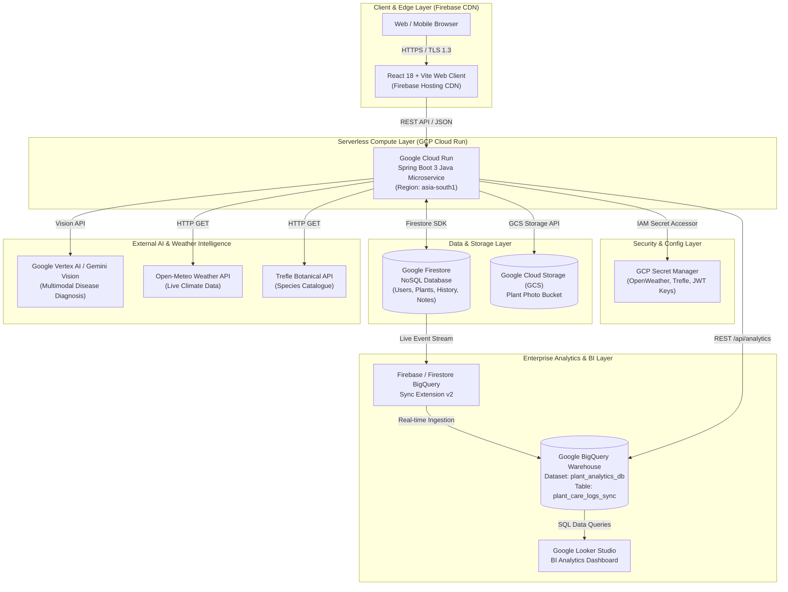

# ☁️ Google Cloud Platform (GCP) System Architecture Document

**Project Name:** PlantCare Enterprise — Smart Plant Care & AI Diagnostics Tracker  
**GCP Project ID:** `plant-watering-tracker-2026`  
**Primary Region:** `asia-south1` (Mumbai, India)  
**Architecture Model:** Serverless Cloud-Native Microservices, Real-Time Streaming Analytics & Multimodal AI Vision  
**Document Version:** `2.0.0`  
**Last Updated:** September 2026  

---

## 🏛️ Executive Summary

The **PlantCare Enterprise** platform is built on Google Cloud Platform (GCP) infrastructure. It combines serverless microservice execution, real-time NoSQL data synchronization, automated event streaming into BigQuery data warehousing, multimodal generative AI (Vertex AI / Gemini), and global CDN hosting via Firebase.

---

## 📐 Architecture Diagram (Mermaid)



---

## 🛠️ GCP Services Breakdown & Technical Specifications

### 1. 🚀 Google Cloud Run
* **Service Name:** `plant-care-service`
* **GCP Region:** `asia-south1` (Mumbai)
* **Production Endpoint:** `https://plant-care-service-358974981913.asia-south1.run.app`
* **Runtime Stack:** Java 17 / Spring Boot 3 microservice in Docker container
* **Key Roles:**
  * Serves REST API endpoints for authentication, plant management, history tracking, and analytics.
  * Handles image processing, streak calculations, and JWT token validation.
  * Auto-scales dynamically based on incoming HTTP request concurrency (0 to 100 container instances).

### 2. ⚡ Google Firestore (NoSQL Database)
* **Database Instance:** `plant-watering-tracker-2026` (Native Mode)
* **Collections Architecture:**
  * `users`: Account profiles, roles (`USER`, `ADMIN`), status (`Active`, `Suspended`), email change verification codes.
  * `plants`: User garden plants (`name`, `species`, `location`, `locationCity`, `frequency`, `lastWatered`, `currentStreak`, `bestStreak`, `sunlight`, `waterMl`).
  * `history`: Care timeline logs (`watering`, `note`, `streak`, `ai_doctor`).
  * `notes`: Plant notes and health records.
* **Key Roles:**
  * Provides low-latency (<50ms) document read/write operations.
  * Serves as the primary source of truth for application state.

### 3. 📊 Google BigQuery (Data Warehouse & BI)
* **Dataset ID:** `plant_watering_tracker-2026:plant_analytics_db`
* **Primary Table:** `plant_care_logs_sync`
* **Ingestion Pipeline:** Streamed live from Firestore using **Firebase BigQuery Sync Extension v2**.
* **Key Roles:**
  * Aggregates global plant species distribution across geographic locations.
  * Computes room streak retention rates and regional heatwave/transpiration correlations.
  * Feeds real-time SQL queries into **Google Looker Studio** for executive BI reporting.

### 4. 🧠 Google Vertex AI & Gemini Vision API
* **API Service:** Multimodal Generative AI Vision Service
* **Key Roles:**
  * `POST /api/vertex-ai/diagnose-disease`: Analyzes leaf photographs to detect plant diseases (powdery mildew, leaf spot, root rot), assess health severity, and generate step-by-step treatment plans.
  * `POST /api/vertex-ai/identify-species`: Identifies unknown plant species from uploaded images.

### 5. 🔑 GCP Secret Manager
* **Service Name:** Secret Manager Config Service
* **Managed Secrets:**
  * `OPENWEATHER_API_KEY`: API key for live regional weather forecasts.
  * `TREFLE_API_TOKEN`: Access token for global botanical catalogue searches.
  * `JWT_SECRET`: Secret key for signing and verifying HS256 JWT tokens.
* **Key Roles:**
  * Prevents hardcoding credentials in source code.
  * Fetched dynamically by Spring Boot at runtime via IAM Service Account permissions.

### 6. 📦 Google Cloud Storage (GCS)
* **Bucket Name:** `plant-watering-tracker-2026.appspot.com`
* **Key Roles:**
  * Stores user-uploaded plant photos and leaf diagnostic images.
  * Integrates with `ImageOptimizationService` to compress and label images before storing.

### 7. 🔥 Firebase Hosting & Firebase Authentication Sync
* **Hosting Domain:** `https://plant-watering-tracker-2026.web.app`
* **Key Roles:**
  * Serves single-page React 18 production bundle over Google's global CDN edge network.
  * Syncs user credentials with Firebase Authentication for identity management.

---

## 📡 Complete REST API Endpoint Inventory

| Module | HTTP Method | Endpoint Path | Description | Authentication |
| :--- | :---: | :--- | :--- | :---: |
| **Auth** | `POST` | `/api/auth/signup` | Register new user account | Public |
| **Auth** | `POST` | `/api/auth/signin` | Authenticate user & issue JWT token | Public |
| **Auth** | `POST` | `/api/auth/forgot-password` | Request password reset email | Public |
| **Users** | `GET` | `/api/users` | Retrieve registered user profile(s) | JWT Required |
| **Users** | `POST` | `/api/users/request-email-change` | Request OTP for email change | JWT Required |
| **Users** | `POST` | `/api/users/verify-email-change` | Verify OTP code & update user email | JWT Required |
| **Plants** | `GET` | `/api/plants` | Retrieve user garden plants | Public / JWT |
| **Plants** | `POST` | `/api/plants` | Add a new plant | JWT Required |
| **Plants** | `GET` | `/api/plants/{id}` | Get single plant details | Public / JWT |
| **Plants** | `PUT` | `/api/plants/{id}` | Update plant details | JWT Required |
| **Plants** | `DELETE` | `/api/plants/{id}` | Remove plant from garden | JWT Required |
| **Plants** | `POST` | `/api/plants/{id}/water` | Log watering & increment streak | JWT Required |
| **History** | `GET` | `/api/history` | Retrieve care activity timeline | JWT Required |
| **Analytics** | `GET` | `/api/analytics/bigquery-report` | Fetch BigQuery analytics report | Public |
| **Analytics** | `POST` | `/api/analytics/bigquery-sync` | Trigger BigQuery stream sync event | Public |
| **Weather** | `GET` | `/api/weather?location={city}` | Get live weather & transpiration index | Public |
| **Species** | `GET` | `/api/species/search?q={query}` | Search botanical database | Public |
| **Secrets** | `GET` | `/api/secrets/status` | Check Secret Manager connection | Public |
| **Storage** | `POST` | `/api/storage/optimize-image` | Upload & optimize leaf photo | Public |
| **Vertex AI** | `POST` | `/api/vertex-ai/diagnose-disease` | Run AI disease diagnosis on leaf photo | Public |
| **Vertex AI** | `POST` | `/api/vertex-ai/identify-species` | Identify plant species using AI | Public |

---

## 🔒 Security, IAM & Compliance

1. **Authentication & Authorization:**
   * Statetagged JSON Web Tokens (JWT) signed with HS256.
   * Role-based access control (`ROLE_USER`, `ROLE_ADMIN`).
2. **Encryption:**
   * **In Transit:** HTTPS / TLS 1.3 enforced across Cloud Run and Firebase CDN.
   * **At Rest:** AES-256 encryption across Firestore, BigQuery, and Google Cloud Storage.
3. **IAM Least Privilege Service Account:**
   * Cloud Run service account is granted granular roles:
     * `roles/datastore.user` (Firestore access)
     * `roles/secretmanager.secretAccessor` (Secret Manager read)
     * `roles/bigquery.dataEditor` (BigQuery stream insertion)
     * `roles/storage.objectAdmin` (GCS bucket upload)

---

## 🚀 Deployment & Operations Command Reference

### Deploy Web Frontend to Firebase CDN
```bash
npm run build
npx firebase-tools deploy --only hosting
```

### Run Full GCP & Backend Automated Health Audit
```bash
node scratch/test_gcp_services_health.js
node scratch/test_full_backend_audit.js
```
