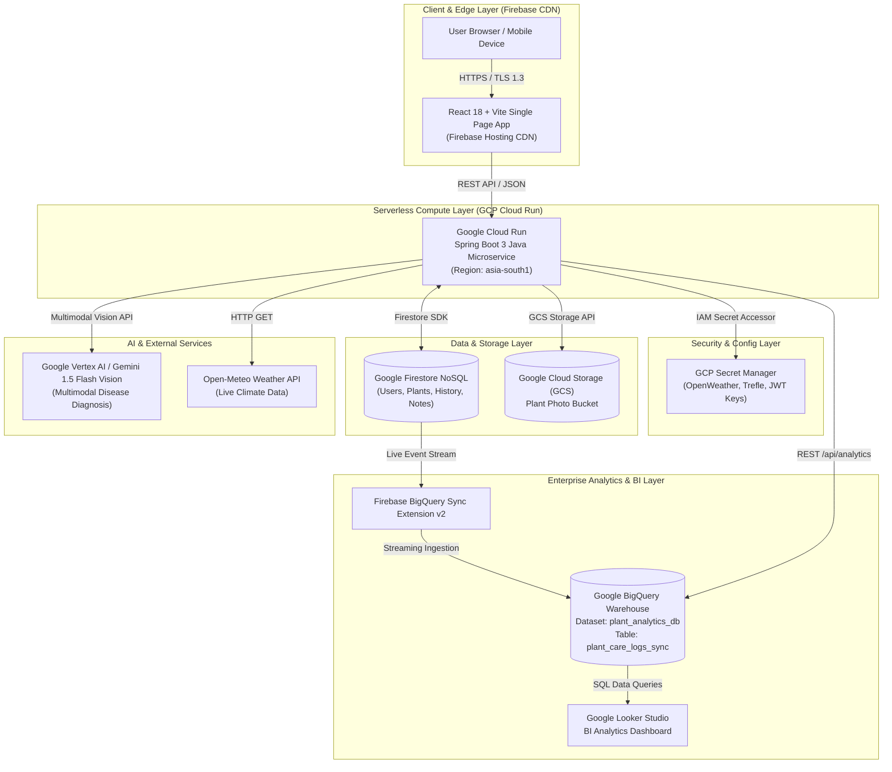

# 🌿 Plant Care Tracker (Plant Water Tracker)

[](https://github.com/Pranesh003/plant-water-tracker)
[](https://plant-watering-tracker-2026.web.app)
[](https://spring.io/projects/spring-boot)
[](https://react.dev/)
[](https://vitejs.dev/)
[](https://cloud.google.com/)
[](LICENSE)

**Plant Care Tracker** is an enterprise-grade, full-stack smart plant care and automated watering management platform. Built on Google Cloud Platform (GCP), Spring Boot 3, and React 18, the application simplifies plant maintenance through automated scheduling, streak retention metrics, real-time weather-adjusted hydration insights, automated species cataloging, downloadable PDF audit reports, administrative controls, live camera photo capture, BigQuery data warehousing, and Google Vertex AI / Gemini Multimodal Vision leaf disease diagnostics.

🌐 **Live Application Deployment**: [https://plant-watering-tracker-2026.web.app](https://plant-watering-tracker-2026.web.app)  
⚙️ **Production Backend API**: [https://plant-care-service-358974981913.asia-south1.run.app](https://plant-care-service-358974981913.asia-south1.run.app)

---

## 📚 Complete System Architecture Documentation

For complete technical specifications, architectural diagrams, API schemas, and deployment pipelines, consult the dedicated documentation modules:

| Specification Module | Description & Link |
| :--- | :--- |
| **☁️ GCP Cloud Architecture** | **[`GCP_ARCHITECTURE.md`](./docs/GCP_ARCHITECTURE.md)** — Multi-tier architecture detailing all 14 GCP Cloud Services (Cloud Run, BigQuery, Vertex AI, Secret Manager, Cloud Storage, Cloud Build, Artifact Registry, Cloud Scheduler, Cloud Logging, Cloud Monitoring, Cloud IAM, Firebase CDN). |
| **☕ Backend Microservices** | **[`BACKEND_SERVICES.md`](./docs/BACKEND_SERVICES.md)** — Java 17 / Spring Boot 3 architecture covering 11 REST Controllers, 6 Core Services, 4 Repositories, DTOs, and JWT security filters. |
| **🗄️ Database & BigQuery Schemas** | **[`DATABASE_SCHEMA.md`](./docs/DATABASE_SCHEMA.md)** — Field-by-field document schemas for Firestore collections (`users`, `plants`, `history`, `notes`), BigQuery table specs (`plant_care_logs_sync`), and ER Diagrams. |
| **📡 REST API Specification** | **[`API_DOCUMENTATION.md`](./docs/API_DOCUMENTATION.md)** — Complete OpenAPI 3.0 reference, request/response JSON payloads, status codes, and cURL commands for all 20 API endpoints. |
| **🎨 Frontend Architecture** | **[`FRONTEND_ARCHITECTURE.md`](./docs/FRONTEND_ARCHITECTURE.md)** — React 18 SPA architecture, component routing, React Context API (`AppProvider`), LocalStorage caching, and Vanilla CSS design tokens. |
| **🧠 AI Multimodal Vision** | **[`AI_VISION_ARCHITECTURE.md`](./docs/AI_VISION_ARCHITECTURE.md)** — Vertex AI / Gemini 1.5 Flash vision diagnostic engine, HTML5 canvas image optimization, and fallback heuristic rules. |
| **🔒 Security & Compliance** | **[`SECURITY_AND_COMPLIANCE.md`](./docs/SECURITY_AND_COMPLIANCE.md)** — OAuth 2.0 / JWT HS256 stateless tokens, Role-Based Access Control (`USER` vs `ADMIN`), multi-step email OTP verification, Secret Manager isolation, and TLS 1.3 / AES-256 encryption. |
| **🚀 DevOps & Operations** | **[`DEVOPS_AND_DEPLOYMENT.md`](./docs/DEVOPS_AND_DEPLOYMENT.md)** — Cloud Build CI/CD pipeline, Artifact Registry image repository commands, Firebase CDN deployment scripts, Cloud Logging, and automated health check commands. |
| **📜 Release Changelog** | **[`CHANGELOG.md`](./docs/CHANGELOG.md)** — Release notes and updates log for v3.0.0. |

---

## 🏛️ System Architecture Diagram



---

## ✨ Core Platform Features

### 👤 End-User Functionality
1. **Interactive Dashboard (`Dashboard.jsx`)**: Displays total garden plants, hydration count, active streak counter, all-time record streak, and watering consistency percentage.
2. **My Plants Grid & Filtering (`MyPlants.jsx`)**: Filter plants by room location (`Living Room`, `Office`, `Garden`, `Balcony`) or care status (`Safe`, `Water Soon`, `Overdue`).
3. **Smart Reminders & Batch Watering (`Reminders.jsx`)**: 1-click batch watering for overdue plants with real-time streak updates.
4. **Plant Health Doctor & Multimodal Diagnostics (`PlantDetails.jsx`)**: Upload leaf photos to analyze diseases (powdery mildew, leaf spot, root rot), obtain health severity ratings (Low, Moderate, Critical), and receive step-by-step organic remedies powered by **Google Vertex AI / Gemini Vision**.
5. **Real-time Garden Analytics (`Analytics.jsx`)**:
   * **My Top Species by Location**: Groups plant species distribution per city.
   * **My Room Streak Retention**: Calculates streak retention percentage and average streak days per room.
   * **Regional Climate Guidance**: Transpiration guidance based on live regional weather.
6. **Care History Timeline (`History.jsx`)**: Audit log for watering events, streak milestones, timeline notes, and AI diagnostic reports.
7. **Profile & Security Settings (`Settings.jsx`)**: Multi-step 6-digit OTP verification for email changes, password updates, theme toggle, and multi-language engine (`i18n.js`).

### 🛡️ Administrative Supervisory Functionality (`AdminDashboard.jsx`)
1. **User Account Administration**: Inspect registered user accounts, assigned roles (`USER`, `ADMIN`), and account statuses (`Active`, `Suspended`).
2. **Account Status Control**: 1-click administrative toggle to suspend or activate accounts.

---

## 🛠️ Technology Stack

| Layer | Technology | Description |
| :--- | :--- | :--- |
| **Frontend Framework** | **React 18.2** | Single-Page Application (SPA) architecture |
| **Build Tool & Bundler** | **Vite 8.2** | Ultra-fast client compilation and code splitting |
| **Styling** | **Vanilla CSS 3** | Tailored design tokens, glassmorphism, responsive grid |
| **Data Visualization** | **Recharts 2.12** | Interactive bar, pie, and timeline charts |
| **Icons & UI** | **Lucide React** | Modern SVG icon library |
| **Backend Framework** | **Spring Boot 3.2.5** | Java 17 serverless microservice container |
| **Security & Auth** | **Spring Security + JWT** | HS256 signed stateless JWT authentication |
| **Database** | **Google Firestore** | Native NoSQL cloud document database |
| **Data Warehouse** | **Google BigQuery** | Enterprise analytics data warehouse (`plant_analytics_db`) |
| **BigQuery Sync** | **Firebase BigQuery Sync v2** | Event streaming extension from Firestore to BigQuery |
| **AI Multimodal Vision** | **Vertex AI / Gemini** | Multimodal Vision API for leaf disease diagnosis |
| **Secret Management** | **GCP Secret Manager** | Managed API key & credential vault |
| **Object Storage** | **Google Cloud Storage (GCS)** | Plant photo bucket storage |
| **Containerization** | **Docker & Cloud Build** | Multi-stage Docker image build pipeline |
| **Container Registry** | **Google Artifact Registry** | Container image storage repository |
| **Compute Hosting** | **Google Cloud Run** | Serverless microservice host in `asia-south1` |
| **Frontend Hosting** | **Firebase Hosting** | Global Edge CDN static web app delivery |

---

## 📡 REST API Endpoint Summary (20 Endpoints)

| Module | Method | Endpoint Path | Description | Access |
| :--- | :---: | :--- | :--- | :---: |
| **Auth** | `POST` | `/api/auth/signup` | Register new user account | Public |
| **Auth** | `POST` | `/api/auth/signin` | Authenticate user & issue JWT | Public |
| **Auth** | `POST` | `/api/auth/forgot-password` | Request password reset email | Public |
| **Users** | `GET` | `/api/users` | Retrieve registered user profile(s) | JWT Required |
| **Users** | `POST` | `/api/users/request-email-change` | Request OTP for email change | JWT Required |
| **Users** | `POST` | `/api/users/verify-email-change` | Verify OTP code & update user email | JWT Required |
| **Plants** | `GET` | `/api/plants` | Get all user garden plants | Public / JWT |
| **Plants** | `POST` | `/api/plants` | Add new plant | JWT Required |
| **Plants** | `GET` | `/api/plants/{id}` | Get plant details by ID | Public / JWT |
| **Plants** | `PUT` | `/api/plants/{id}` | Update plant details | JWT Required |
| **Plants** | `DELETE` | `/api/plants/{id}` | Remove plant from garden | JWT Required |
| **Plants** | `POST` | `/api/plants/{id}/water` | Water plant & increment streak | JWT Required |
| **History** | `GET` | `/api/history` | Get care history activity timeline | JWT Required |
| **Analytics** | `GET` | `/api/analytics/bigquery-report` | Fetch BigQuery analytics report | Public |
| **Analytics** | `POST` | `/api/analytics/bigquery-sync` | Trigger BigQuery stream sync event | Public |
| **Weather** | `GET` | `/api/weather?location={city}` | Get live weather forecast | Public |
| **Species** | `GET` | `/api/species/search?q={query}` | Search botanical database | Public |
| **Secrets** | `GET` | `/api/secrets/status` | Check Secret Manager status | Public |
| **Storage** | `POST` | `/api/storage/optimize-image` | Upload & optimize leaf photo | Public |
| **Vertex AI** | `POST` | `/api/vertex-ai/diagnose-disease` | Run AI disease diagnosis | Public |

---

## ⚙️ Local Setup & Development Guide

### Prerequisites
* **Node.js**: `v18.x` or higher
* **Java Development Kit (JDK)**: `OpenJDK 17` or Temurin 17
* **Apache Maven**: `v3.9.x`

### 1. Clone Repository & Install Dependencies
```bash
git clone https://github.com/Pranesh003/plant-water-tracker.git
cd plant-water-tracker
npm install
```

### 2. Run Local Frontend Development Server
```bash
npm run dev
# App will start locally at http://localhost:5173
```

### 3. Run Backend Java Microservice Locally
```bash
cd backend/plant-care-service
mvn clean spring-boot:run
# Microservice will start at http://localhost:8080
```

---

## 🚀 Cloud Deployment Commands

### Build & Deploy Web Frontend to Firebase Edge CDN
```bash
npm run build
npx firebase-tools deploy --only hosting
```

### Run Full System Automated Health Audit
```bash
# Run 19-Endpoint Backend REST Audit
node scratch/test_full_backend_audit.js

# Run 7-Service GCP Infrastructure Health Audit
node scratch/test_gcp_services_health.js
```

---

## 📄 License & Author

Developed by **Pranesh** — Built on Google Cloud Platform & Firebase Infrastructure.  
Licensed under the **MIT License**.
