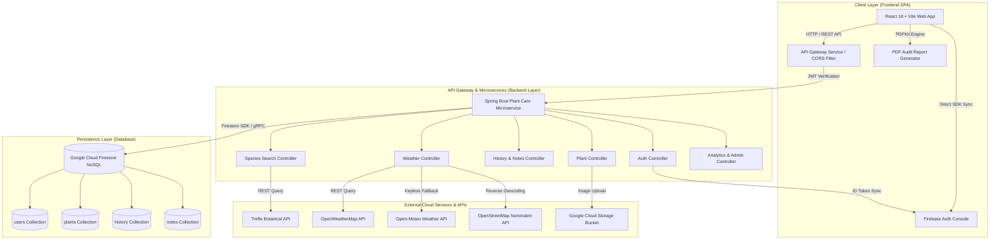
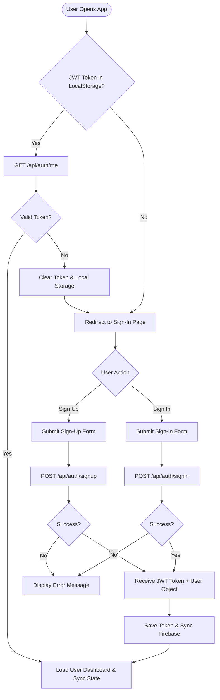
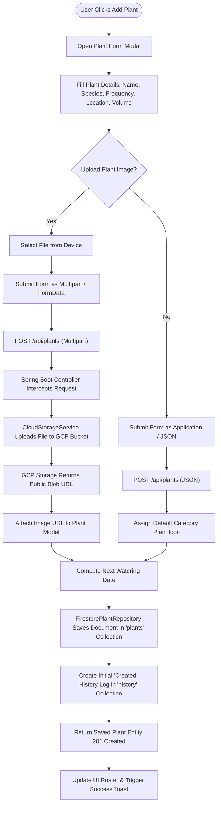
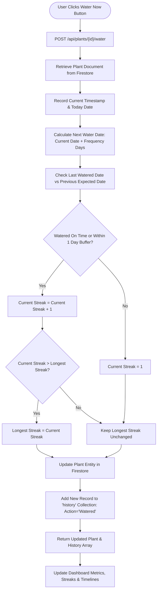
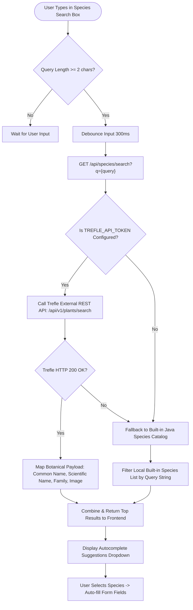
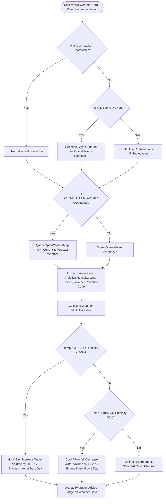
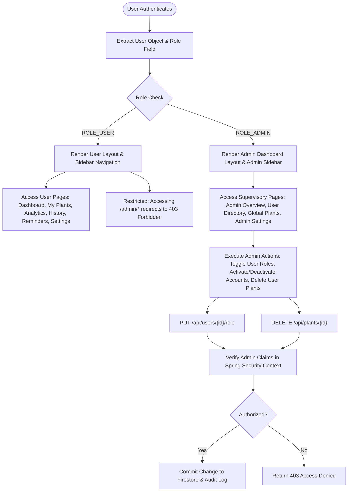
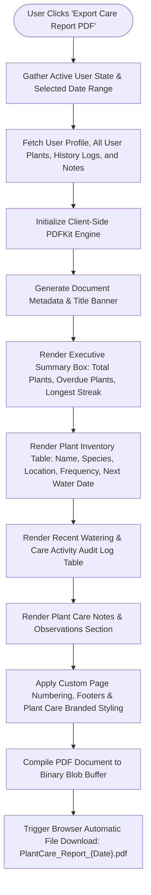

# 🌿 Plant Care Tracker (Plant Water Tracker)

[](https://github.com/Pranesh003/plant-water-tracker)
[](https://spring.io/projects/spring-boot)
[](https://react.dev/)
[](https://vitejs.dev/)
[](https://firebase.google.com/)
[](https://cloud.google.com/)
[](LICENSE)

**Plant Care Tracker** is an enterprise-grade, full-stack smart plant care and automated watering management platform. Designed for plant enthusiasts, home gardeners, urban farmers, and agricultural administrators, the application simplifies plant maintenance through intelligent scheduling, streak retention metrics, real-time weather-adjusted hydration insights, automated species cataloging, downloadable PDF audit reports, and multi-tenant administrative controls.

---

## 📋 Table of Contents

- [🌿 Plant Care Tracker (Plant Water Tracker)](#-plant-care-tracker-plant-water-tracker)
  - [📋 Table of Contents](#-table-of-contents)
  - [🚀 Executive Summary \& Vision](#-executive-summary--vision)
  - [✨ Core Platform Features](#-core-platform-features)
    - [👤 End-User Functionality](#-end-user-functionality)
    - [🛡️ Administrative Supervisory Functionality](#️-administrative-supervisory-functionality)
  - [🏗️ System Architecture](#️-system-architecture)
  - [🔄 Process Flowcharts \& Sequence Diagrams](#-process-flowcharts--sequence-diagrams)
    - [1. User Authentication \& Session Authorization Flow](#1-user-authentication--session-authorization-flow)
    - [2. Plant Registration \& GCP Cloud Storage Image Upload Pipeline](#2-plant-registration--gcp-cloud-storage-image-upload-pipeline)
    - [3. Automated Watering Schedule \& Streak Calculation Engine](#3-automated-watering-schedule--streak-calculation-engine)
    - [4. Species Search \& Botanical Metadata Aggregation (Trefle API)](#4-species-search--botanical-metadata-aggregation-trefle-api)
    - [5. Smart Weather-Adjusted Hydration Recommendation Engine](#5-smart-weather-adjusted-hydration-recommendation-engine)
    - [6. Administrative Role-Based Access Control (RBAC) Workflow](#6-administrative-role-based-access-control-rbac-workflow)
    - [7. Care Audit Log \& PDF Report Export Process](#7-care-audit-log--pdf-report-export-process)
  - [💻 Technology Stack Breakdown](#-technology-stack-breakdown)
  - [📂 Comprehensive Project Directory Structure](#-comprehensive-project-directory-structure)
  - [🗄️ Database Schemas \& Firestore Document Models](#️-database-schemas--firestore-document-models)
    - [`users` Collection](#users-collection)
    - [`plants` Collection](#plants-collection)
    - [`history` Collection](#history-collection)
    - [`notes` Collection](#notes-collection)
  - [📡 REST API Endpoints Specification](#-rest-api-endpoints-specification)
  - [⚙️ Local Setup \& Installation Guide](#️-local-setup--installation-guide)
    - [Prerequisites](#prerequisites)
    - [1. Clone Repository](#1-clone-repository)
    - [2. Configure Environment Variables](#2-configure-environment-variables)
    - [3. Backend Spring Boot Setup \& Execution](#3-backend-spring-boot-setup--execution)
    - [4. Frontend Vite/React Setup \& Execution](#4-frontend-vitereact-setup--execution)
    - [5. Express Proxy/Mock Server (Optional)](#5-express-proxymock-server-optional)
  - [☁️ Cloud Deployment Guide](#️-cloud-deployment-guide)
    - [Backend (Google Cloud Run)](#backend-google-cloud-run)
    - [Frontend (Firebase Hosting)](#frontend-firebase-hosting)
  - [🛡️ Security, Authentication \& Access Control](#️-security-authentication--access-control)
  - [🔧 Troubleshooting \& Frequently Asked Questions](#-troubleshooting--frequently-asked-questions)
  - [📄 License \& Author](#-license--author)

---

## 🚀 Executive Summary & Vision

Plant care requires consistency, precise moisture management, and awareness of environmental conditions. Over-watering or under-watering is the leading cause of houseplant mortality. **Plant Care Tracker** bridges the gap between manual care and automated intelligence by offering:

1. **Precision Hydration Schedules**: Calculates next watering deadlines based on species moisture requirements, pot sizing, and ambient environment.
2. **Environmental Adaptation**: Connects with live weather providers (OpenWeather API and Open-Meteo) to dynamically compute temperature, humidity, and rainfall factors that adjust recommended watering volumes.
3. **Gamified Care Streaks**: Encourages timely maintenance with automated streak counters, achievement badges, and history logs.
4. **Botanical Knowledge Integration**: Integrates the Trefle API for auto-completing species details, family names, and growth attributes.
5. **Enterprise Multi-Tenancy**: Built with Spring Boot 3 microservice architecture, Google Cloud Firestore NoSQL storage, and Google Cloud Storage for media assets, supporting regular users and system administrators.

---

## ✨ Core Platform Features

### 👤 End-User Functionality

- **Interactive Dashboard**:
  - Live summary metrics (Total Plants, Watered Today, Pending Reminders, Active Streak).
  - Upcoming care timeline for the next 7 days.
  - Live weather forecast card with real-time temperature, humidity, wind speed, and location auto-detection.
  - Interactive quick-water buttons to record hydration events in one click.

- **Plant Collection Management**:
  - Create, view, update, and delete individual plant profiles.
  - Custom fields: Name, Scientific Species, Category (Indoor, Outdoor, Succulent, Herb, Flowering, Fern, Fiddle Leaf, etc.), Watering Frequency (days), Water Volume (ml), Location, Sunlight Requirements, and Acquisition Date.
  - File upload support for plant photos stored securely in **Google Cloud Storage** buckets.

- **Smart Hydration & Streak Engine**:
  - Auto-calculates `nextWateringDate` based on `lastWateredDate` + `wateringFrequency`.
  - Calculates care streaks (`currentStreak` and `longestStreak`) based on watering logs.
  - Visual status badges: `Overdue` (red), `Due Today` (amber), `Healthy` (green).

- **Care History & Logging**:
  - Detailed historical timeline of every watering event, fertilization, pruning, and repotting.
  - Filterable by date, action type, and specific plant.

- **Notes & Observation Tracker**:
  - Attach rich text notes with dates and custom titles to track plant growth, pest treatments, or repotting observations.

- **Species Botanical Search**:
  - Integrated Trefle API autocomplete for searching thousands of plant species with scientific names, family taxonomies, and built-in fallback catalogs.

- **Analytical Insights & Data Visualization**:
  - Recharts-powered graphs analyzing watering consistency over 30 days.
  - Plant distribution by category and indoor vs. outdoor location metrics.

- **PDF Health Audit Report Export**:
  - One-click generation of comprehensive PDF care summary reports containing user information, plant rosters, upcoming schedules, and recent logs.

- **User Profile & Account Security**:
  - Firebase Authentication + Spring Security JWT authentication.
  - Password change, password reset link request via email, and profile preference management.

---

### 🛡️ Administrative Supervisory Functionality

- **Executive Admin Dashboard**:
  - Platform-wide statistics: Total Registered Users, Total Active Plants, Overall Platform Streak, System Health Indicators.
- **User Directory & Management**:
  - View all user profiles, toggle user roles (`ROLE_USER` vs. `ROLE_ADMIN`), activate/deactivate user access, and inspect individual user plant collections.
- **Global Plant Supervision**:
  - View all plants registered across the platform with user ownership details.
- **System Configuration**:
  - Admin settings for configuring platform maintenance modes, global default notification intervals, and logging thresholds.

---

## 🏗️ System Architecture

The project follows a decoupled **Client-Server Microservices Architecture** with cloud-native integrations on Google Cloud Platform and Firebase.



---

## 🔄 Process Flowcharts & Sequence Diagrams

### 1. User Authentication & Session Authorization Flow



---

### 2. Plant Registration & GCP Cloud Storage Image Upload Pipeline



---

### 3. Automated Watering Schedule & Streak Calculation Engine



---

### 4. Species Search & Botanical Metadata Aggregation (Trefle API)



---

### 5. Smart Weather-Adjusted Hydration Recommendation Engine



---

### 6. Administrative Role-Based Access Control (RBAC) Workflow



---

### 7. Care Audit Log & PDF Report Export Process



---

## 💻 Technology Stack Breakdown

| Layer | Technology | Version | Purpose |
| :--- | :--- | :--- | :--- |
| **Frontend Framework** | React.js | `18.3.x` | Reactive UI Component Framework |
| **Build Tooling** | Vite | `5.x` | Lightning-fast HMR bundler & development server |
| **Routing** | React Router DOM | `6.x` | Single Page Application (SPA) client-side routing |
| **Icons & Design** | Lucide React | Latest | Modern SVG icon library |
| **Data Visualization** | Recharts | Latest | Interactive charts & analytics rendering |
| **PDF Generation** | PDFKit / Blob Engine | `0.20.x` | In-browser downloadable PDF report generation |
| **Backend Framework** | Spring Boot | `3.x` | Java enterprise microservice framework |
| **Security & Auth** | Spring Security + JWT | `3.x` | Stateless API authentication & RBAC authorization |
| **Database** | Google Cloud Firestore | API v1 | NoSQL cloud document store for real-time data persistence |
| **Media Storage** | Google Cloud Storage | API v2 | Cloud object storage bucket for plant photos |
| **Identity Service** | Firebase Auth | `12.x` | User authentication console & user credential synchronization |
| **Botanical API** | Trefle API | v1 | External REST service for species lookup & taxonomy |
| **Weather API** | OpenWeatherMap / Open-Meteo | v2.5 / v1 | Real-time weather forecasting & hydration adjustment |
| **Reverse Geocoding** | Nominatim (OpenStreetMap) | v2 | City resolution from GPS latitude and longitude |

---

## 📂 Comprehensive Project Directory Structure

```directory
plant_watering/
├── .firebase/                        # Firebase CLI deployment cache
├── .firebaserc                       # Firebase project target aliases
├── .gitignore                        # Git file exclusion rules
├── firebase.json                     # Firebase Hosting & rewrite configurations
├── index.html                        # Application main HTML entry point
├── package.json                      # Node.js project manifest & script declarations
├── pnpm-lock.yaml                    # PNPM deterministic dependency lockfile
├── vite.config.js                    # Vite bundler configuration & proxy setups
├── README.md                         # Comprehensive documentation repository
│
├── backend/                          # Backend Spring Boot Microservices
│   ├── api-gateway/                  # Spring Cloud API Gateway Service
│   │   ├── pom.xml                   # Maven dependencies for API Gateway
│   │   └── src/                      # Gateway routes and filtering logic
│   └── plant-care-service/           # Primary Core Business Logic Microservice
│       ├── Dockerfile                # Containerization setup for Cloud Run
│       ├── pom.xml                   # Maven dependencies (Spring Boot, GCP, Firebase)
│       ├── application.yml           # Application configuration & GCP profiles
│       └── src/main/java/com/plantcare/service/
│           ├── PlantCareServiceApplication.java   # Spring Boot Main Entry Class
│           ├── config/               # Security, Firebase & Firestore Configuration
│           │   ├── FirebaseConfig.java            # Firebase Admin SDK Initialization
│           │   ├── FirestoreConfig.java           # GCP Firestore Client Configuration
│           │   └── SecurityConfig.java            # Spring Security JWT & CORS setup
│           ├── controller/           # REST API Web Controllers
│           │   ├── AnalyticsController.java       # User & Admin analytics endpoints
│           │   ├── AuthController.java            # Auth, Login, Sign Up, JWT refresh
│           │   ├── HistoryController.java          # Care history & audit logs
│           │   ├── PlantController.java            # CRUD operations for Plants & Image Upload
│           │   ├── SpeciesController.java          # Trefle API integration & fallbacks
│           │   ├── UserController.java             # User management & profile endpoints
│           │   └── WeatherController.java          # OpenWeather & Open-Meteo weather intelligence
│           ├── dto/                  # Data Transfer Objects
│           │   ├── ForgotPasswordRequest.java     # Forgot password request payload
│           │   ├── PlantRequest.java              # Plant creation/update payload
│           │   └── ResetPasswordRequest.java      # Password reset payload
│           ├── firestore/            # Firestore Repository Layer
│           │   ├── FirestoreHistoryRepository.java # History Collection DAO
│           │   ├── FirestoreNoteRepository.java    # Notes Collection DAO
│           │   ├── FirestorePlantRepository.java   # Plants Collection DAO
│           │   └── FirestoreUserRepository.java    # Users Collection DAO
│           ├── model/                # Core Domain Entity Models
│           │   ├── History.java                   # History audit log model
│           │   ├── Note.java                      # Note observation model
│           │   ├── Plant.java                     # Plant core entity model
│           │   └── User.java                      # User entity & role authorization model
│           └── service/              # Utility & Integration Services
│               ├── CloudStorageService.java        # GCP Cloud Storage Bucket Handler
│               └── EmailService.java               # SMTP Email notification service
│
├── server/                           # Node.js Express Proxy & Mock Server
│   ├── index.js                      # Express server entry point
│   └── package.json                  # Express dependencies
│
├── public/                           # Static Public Assets & Graphics
│   ├── favicon.ico                   # Web Application Favicon
│   ├── app_logo.png                  # Application Primary Logo
│   ├── PlantCare_Project_Report.pdf  # Sample generated PDF report asset
│   └── plant_icons/                  # Default category plant avatars
│
└── src/                             # React 18 Frontend Application
    ├── App.jsx                       # Main App Component with Client Routing
    ├── main.jsx                      # React DOM Entry Point & Context Providers
    ├── index.css                     # Custom Design System, Glassmorphism & Animations
    ├── firebase.js                   # Client Firebase Authentication SDK config
    ├── components/                   # Reusable UI Components
    │   ├── AdminSidebar.jsx          # Admin Portal Navigation Drawer
    │   ├── Navbar.jsx                # Top Header Navigation Bar
    │   ├── PlantCard.jsx             # Individual Plant Profile Card with Water Button
    │   ├── PlantForm.jsx             # Add/Edit Plant Modal Dialog
    │   ├── PlantSearch.jsx           # Trefle Autocomplete Search Component
    │   ├── PlantStatusBadge.jsx      # Overdue / Due Today / Healthy Badge
    │   ├── StreakBadge.jsx           # Gamified Streak Counter Badge
    │   ├── WeatherCard.jsx           # Live Weather & Hydration Advisory Card
    │   └── PasswordStrength.jsx      # Password complexity meter
    ├── context/                      # React Context Stores
    ├── data/                         # Static Catalog Datasets
    │   ├── mockPlants.js             # Initial fallback plant suggestions
    │   └── tnDistricts.js            # Regional locations & district mappings
    ├── pages/                        # View Pages & Route Destinations
    │   ├── AddPlant.jsx              # Standalone Add Plant Page
    │   ├── AdminDashboard.jsx        # Admin System Metrics & Overview
    │   ├── AdminPlants.jsx           # Admin Global Plant Supervision
    │   ├── AdminSettings.jsx         # Admin System Configurations
    │   ├── AdminUsers.jsx            # Admin User Directory & Role Management
    │   ├── Analytics.jsx             # Analytics Charts & Consistency Visuals
    │   ├── AuthLoadingScreen.jsx     # Auth state synchronization splash
    │   ├── ChangePassword.jsx        # Password Change Settings View
    │   ├── Dashboard.jsx             # User Primary Dashboard & Timeline
    │   ├── ForgotPassword.jsx        # Password Reset Link Request View
    │   ├── History.jsx               # Care Audit Logs & History Timeline
    │   ├── MyPlants.jsx              # Personal Plant Collection Roster
    │   ├── PlantDetails.jsx          # Detailed Single Plant View & Care Log
    │   ├── Reminders.jsx             # Care Schedule & Upcoming Reminders
    │   ├── Settings.jsx              # User Account Preferences & Export PDF
    │   ├── SignIn.jsx                # User Authentication Login Page
    │   └── SignUp.jsx                # User Registration Page
    ├── services/                     # API Communication Layer
    │   └── api.js                    # Fetch Wrapper with JWT interceptors & retries
    └── utils/                        # Utility & Helper Functions
        ├── plantIconUtils.js         # Category icon resolver
        ├── storageUtils.js           # LocalStorage wrapper
        ├── themeUtils.js             # Dark/Light theme switcher
        └── wateringUtils.js          # Next water calculation & streak logic
```

---

## 🗄️ Database Schemas & Firestore Document Models

### `users` Collection

```json
{
  "id": "usr_982347912",
  "name": "Jane Doe",
  "email": "jane.doe@example.com",
  "password": "$2a$10$e8Z... (BCrypt Hashed)",
  "role": "user",
  "location": "Chennai, Tamil Nadu",
  "createdAt": "2026-01-15T08:30:00Z",
  "updatedAt": "2026-08-30T12:00:00Z"
}
```

### `plants` Collection

```json
{
  "id": "plnt_550e8400",
  "userId": "usr_982347912",
  "name": "Monstera Deliciosa",
  "species": "Monstera deliciosa",
  "category": "Indoor",
  "wateringFrequency": 7,
  "lastWateredDate": "2026-08-25",
  "nextWateringDate": "2026-09-01",
  "waterVolumeMl": 500,
  "location": "Living Room Window",
  "sunlight": "Indirect Sunlight",
  "imageUrl": "https://storage.googleapis.com/plant-care-bucket/monstera.jpg",
  "notes": "Loves daily misting",
  "currentStreak": 5,
  "longestStreak": 12,
  "createdAt": "2026-02-01T10:00:00Z"
}
```

### `history` Collection

```json
{
  "id": "hist_1029384",
  "userId": "usr_982347912",
  "plantId": "plnt_550e8400",
  "plantName": "Monstera Deliciosa",
  "action": "Watered",
  "date": "2026-08-25",
  "time": "09:15 AM",
  "notes": "Added liquid fertilizer"
}
```

### `notes` Collection

```json
{
  "id": "note_8839201",
  "userId": "usr_982347912",
  "plantId": "plnt_550e8400",
  "title": "New Leaf Emergence",
  "content": "A beautiful new fenestrated leaf started unfurling today!",
  "date": "2026-08-28"
}
```

---

## 📡 REST API Endpoints Specification

| Method | Endpoint | Auth | Role | Description |
| :--- | :--- | :---: | :---: | :--- |
| `POST` | `/api/auth/signup` | ❌ | All | Register new user account |
| `POST` | `/api/auth/signin` | ❌ | All | Authenticate user & return JWT Token |
| `GET` | `/api/auth/me` | ✅ | User/Admin | Retrieve current authenticated user profile |
| `POST` | `/api/auth/forgot-password` | ❌ | All | Request password reset link |
| `POST` | `/api/auth/reset-password` | ❌ | All | Reset password with token |
| `GET` | `/api/plants` | ✅ | User/Admin | Get all plants for current user (or all plants if Admin) |
| `GET` | `/api/plants/{id}` | ✅ | User/Admin | Get plant details by ID |
| `POST` | `/api/plants` | ✅ | User/Admin | Create plant (JSON or Multipart with image file) |
| `PUT` | `/api/plants/{id}` | ✅ | User/Admin | Update existing plant details |
| `DELETE`| `/api/plants/{id}` | ✅ | User/Admin | Delete plant entity and associated logs |
| `POST` | `/api/plants/{id}/water` | ✅ | User/Admin | Quick-water plant & calculate streak |
| `GET` | `/api/history` | ✅ | User/Admin | Retrieve care history logs |
| `GET` | `/api/species/search` | ✅ | User/Admin | Search botanical species via Trefle API |
| `GET` | `/api/weather` | ✅ | User/Admin | Fetch real-time weather & hydration advisory |
| `GET` | `/api/analytics/dashboard` | ✅ | User/Admin | Retrieve dashboard analytics metrics |
| `GET` | `/api/users` | ✅ | Admin | List all registered platform users |
| `GET` | `/api/users/{id}` | ✅ | Admin | Fetch user profile & plant details by User ID |
| `PUT` | `/api/users/{id}/role` | ✅ | Admin | Change user role (`user` vs `admin`) |

---

## ⚙️ Local Setup & Installation Guide

### Prerequisites

Ensure you have the following installed on your developer workstation:
- **Node.js**: `v18.0.0` or higher
- **PNPM** or **NPM**: `v9.0.0+` / `v10.0.0+`
- **Java Development Kit (JDK)**: `JDK 17` or `JDK 21`
- **Apache Maven**: `v3.8+`
- **Git**: `v2.x+`
- **Google Cloud GCP Service Account**: Key file with Firestore & Storage admin privileges.

---

### 1. Clone Repository

```bash
git clone https://github.com/Pranesh003/plant-water-tracker.git
cd plant-water-tracker
```

---

### 2. Configure Environment Variables

Create `.env` file in root directory:

```env
VITE_API_URL=http://localhost:8080
VITE_FIREBASE_API_KEY=your_firebase_api_key
VITE_FIREBASE_AUTH_DOMAIN=your_project.firebaseapp.com
VITE_FIREBASE_PROJECT_ID=your_project_id
VITE_FIREBASE_STORAGE_BUCKET=your_project.appspot.com
VITE_FIREBASE_MESSAGING_SENDER_ID=your_sender_id
VITE_FIREBASE_APP_ID=your_app_id
```

Configure Environment Variables for Spring Boot (`backend/plant-care-service`):

```powershell
$env:TREFLE_API_TOKEN="your_trefle_api_token"
$env:OPENWEATHER_API_KEY="your_openweather_api_key"
$env:GOOGLE_APPLICATION_CREDENTIALS="C:\path\to\gcp-service-account.json"
```

---

### 3. Backend Spring Boot Setup & Execution

```bash
cd backend/plant-care-service
mvn clean install
mvn spring-boot:run
```

The Spring Boot application will launch on **`http://localhost:8080`**.

---

### 4. Frontend Vite/React Setup & Execution

Open a new terminal session in the project root:

```bash
pnpm install
pnpm dev
```

The Vite development server will launch on **`http://localhost:5173`** (or `http://127.0.0.1:5173`).

---

### 5. Express Proxy/Mock Server (Optional)

If developing without the Spring Boot backend:

```bash
cd server
npm install
npm start
```

---

## ☁️ Cloud Deployment Guide

### Backend (Google Cloud Run)

1. Build container image using Docker:
   ```bash
   cd backend/plant-care-service
   gcloud builds submit --tag gcr.io/YOUR_PROJECT_ID/plant-care-service
   ```
2. Deploy image to Cloud Run:
   ```bash
   gcloud run deploy plant-care-service \
     --image gcr.io/YOUR_PROJECT_ID/plant-care-service \
     --platform managed \
     --region asia-south1 \
     --allow-unauthenticated \
     --set-env-vars TREFLE_API_TOKEN=your_token,OPENWEATHER_API_KEY=your_key
   ```

### Frontend (Firebase Hosting)

1. Build production static bundle:
   ```bash
   pnpm build
   ```
2. Deploy to Firebase:
   ```bash
   firebase deploy --only hosting
   ```

---

## 🛡️ Security, Authentication & Access Control

- **Stateless JWT Tokens**: Upon successful sign-in, Spring Security issues an HTTP Bearer JWT token stored securely in `localStorage`.
- **Firebase Authentication Sync**: User creation automatically synchronizes with Firebase Authentication Console to provide seamless OAuth and identity persistence.
- **Role-Based Guards**: Protected endpoints and UI components check for `ROLE_ADMIN` permissions before granting access to sensitive administrative actions.
- **CORS Protection**: Spring Security config specifies exact allowed origins to prevent unauthorized cross-domain request exploitation.

---

## 🔧 Troubleshooting & Frequently Asked Questions

**Q1: The application fails to connect to Firestore on local start.**
* **Solution**: Ensure `$env:GOOGLE_APPLICATION_CREDENTIALS` points to a valid GCP Service Account JSON key with `Cloud Datastore User` or `Owner` permissions.

**Q2: Weather forecast displays fallback data instead of local city weather.**
* **Solution**: Verify that `OPENWEATHER_API_KEY` is set in the terminal before running Spring Boot. If unset, the service automatically uses keyless Open-Meteo fallback.

**Q3: Plant species search returns built-in fallback results.**
* **Solution**: Provide a valid `TREFLE_API_TOKEN` environment variable to enable live searching of external Trefle botanical databases.

---

## 📄 License & Author

Distributed under the **MIT License**. See `LICENSE` for more information.

Developed with ❤️ by **MY TEAM**.
