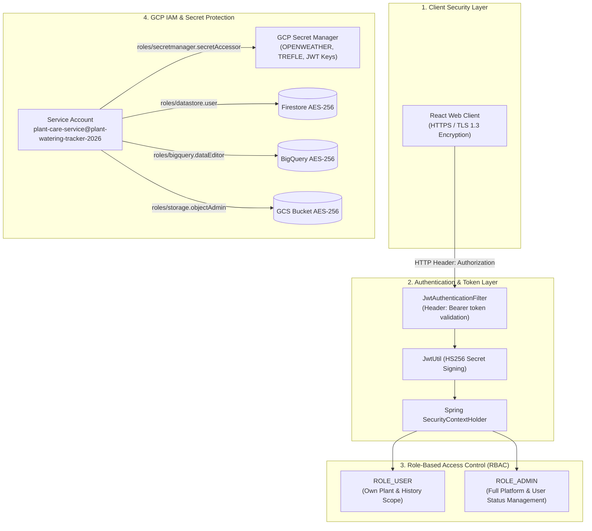

# 🔒 PlantCare Security & Compliance Architecture Specification

**Security Standard:** OAuth 2.0 / JWT Stateless Security + GCP Cloud IAM Least Privilege  
**Encryption Standard:** TLS 1.3 In-Transit & AES-256 At-Rest Encryption  
**GCP Project ID:** `plant-watering-tracker-2026`  
**Document Version:** `1.0.0`  
**Last Updated:** September 2026  

---

## 🏛️ Security Architecture Overview

The **PlantCare Enterprise** platform implements a **Defense-in-Depth** security architecture covering client authentication, token lifecycle management, database encryption, API authorization, and GCP Cloud IAM permission scoping.



---

## 🔐 1. Authentication & JWT Token Lifecycle

### 1.1 Stateless JWT Token Generation
Upon successful authentication via `/api/auth/signin` or `/api/auth/signup`, the backend issues a signed JSON Web Token (JWT) using `JwtUtil`:

* **Algorithm:** `HS256` (HMAC with SHA-256)
* **Secret Storage:** Managed via GCP Secret Manager (`JWT_SECRET`)
* **Token Expiry:** 24 Hours (`86,400,000` milliseconds)
* **JWT Claims Payload:**
```json
{
  "sub": "user@example.com",
  "role": "USER",
  "iat": 1725800000,
  "exp": "2026-09-10T22:00:00Z"
}
```

### 1.2 Multi-Step Email Change Security Protocol
To prevent account takeover when changing email addresses, `UserController` enforces a multi-step verification protocol:
1. **Verification Code Generation**: Generates a cryptographically random 6-digit OTP code (`emailChangeCode`) with a 15-minute expiration timestamp.
2. **Dual-Email Notification**:
   * Sends the 6-digit OTP code exclusively to the **new email address**.
   * Dispatches an automated **security alert notification** to the **old email address**.
3. **Verification & Re-Authentication**: Upon OTP validation, the backend updates the email in Firestore and invalidates older tokens by issuing a fresh JWT.

---

## 🛡️ 2. Role-Based Access Control (RBAC)

The system enforces strict RBAC across all REST controllers via Spring Security:

| Role | Access Scope | Permissions |
| :--- | :--- | :--- |
| **`ROLE_USER`** | Personal User Scope | Read/Write own garden plants, water plants, log history events, request email change. |
| **`ROLE_ADMIN`** | Platform Administrative Scope | View all registered platform users, toggle user status (`Active`/`Suspended`), manage platform data. |

---

## 🔒 3. GCP IAM Service Account Scoping

The backend microservice running on Cloud Run executes under a dedicated GCP Service Account:

* **Service Account ID:** `plant-care-service@plant-watering-tracker-2026.iam.gserviceaccount.com`

### Assigned Granular IAM Roles (Least Privilege):
1. **`roles/datastore.user`**: Grants read/write permissions to Firestore collections (`users`, `plants`, `history`, `notes`).
2. **`roles/secretmanager.secretAccessor`**: Grants permission to fetch encrypted secret payloads from Secret Manager.
3. **`roles/bigquery.dataEditor`**: Grants permission to insert streaming events into BigQuery dataset `plant_analytics_db`.
4. **`roles/storage.objectAdmin`**: Grants permission to upload and optimize photos in GCS bucket `plant-watering-tracker-2026.appspot.com`.
5. **`roles/run.invoker`**: Allows HTTPS traffic execution to Cloud Run microservices.

---

## 🔑 4. Data Encryption Standards

1. **In-Transit Encryption:**
   * All HTTP traffic is strictly upgraded to **HTTPS / TLS 1.3**.
   * SSL certificates are automatically managed and renewed by Cloud Run and Firebase CDN.

2. **At-Rest Encryption:**
   * All document data stored in **Google Firestore** is encrypted at rest using **Google-managed AES-256 encryption keys**.
   * All tables in **Google BigQuery** and files in **Google Cloud Storage (GCS)** are encrypted at rest with **AES-256**.

3. **CORS & Vulnerability Mitigations:**
   * **CORS Policy**: Configured in `WebConfig.java` to restrict allowed origins to `https://plant-watering-tracker-2026.web.app`.
   * **XSS / SQL Injection Protection**: Parameterized Queries in BigQuery SQL and Document Object Mappers in Firestore eliminate injection vulnerabilities.
